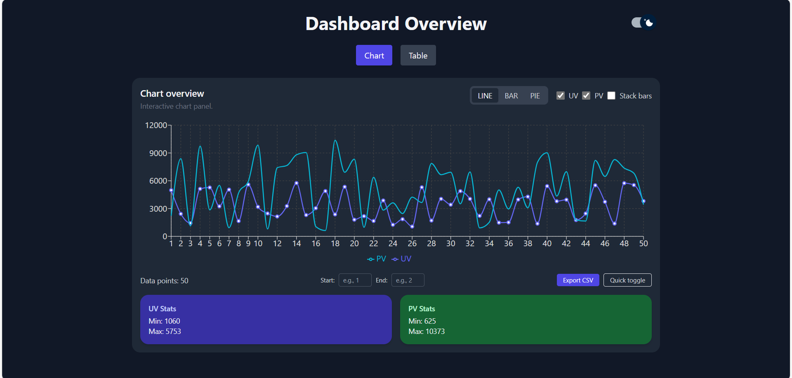
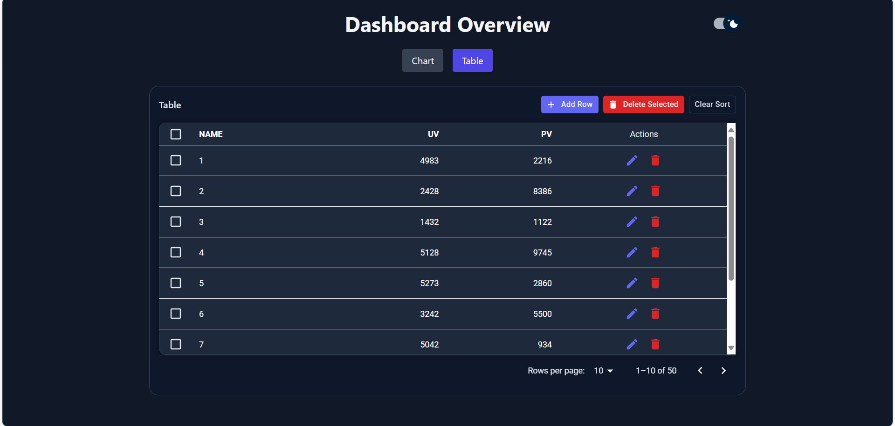

# CtrlB Assignment

This is a React-based dashboard that visualizes data using charts
and tables, and offers smooth interactions like switching chart types and
adding/deleting rows (single and batch).

[GitHub Repository](https://github.com/lilypandey/ctrlb_assignment)

---

## Overview

The app has two main sections:

### Chart Panel
- Supports **Line**, **Bar**, and **Pie** charts (built with Recharts).
- Lets you toggle which data series are visible (UV/PV).
- Has an option to stack bars.
- Exports current chart data as a CSV file.
- Fully responsive and adapts to dark/light mode.

### Table Panel
- Displays the same dataset in a table format.
- You can **add**, **edit**, or **delete** rows.
- Supports **multi-select** with checkboxes and **batch delete**.
- Sorting, pagination, and inline editing are all built-in.
- Any edits reflect immediately in the chart data.

---

## Features

- Dark / light theme toggle (custom MUI switch)
- Inline row editing with save and delete actions
- Chart type switcher (Line / Bar / Pie)
- CSV export button
- Sorting and pagination for better performance
- Smooth transitions and minimal re-renders

---

## Tech Stack

- **React** (Vite setup)
- **Material UI (MUI)** – for components like table, buttons, icons
- **Recharts** – for data visualization using charts
- **Tailwind CSS** – for styling
- **React Hooks** – for managing state and effects

---

## Getting Started

Make sure to have Node.js installed.

```bash
# install dependencies
npm install

# start development server
npm run dev
```



